# Site Owner Guide (Draft)

## Overview

This guide is the working owner reference for Sikhwari Group (Pty) Ltd website operations.
It summarizes where key content lives, what guardrails apply, and how to generate a repeatable screenshot pack.

## Updating legal identity placeholders

- Keep the legal company name as `Sikhwari Group (Pty) Ltd` where legal identity is shown.
- Update registration/contact placeholders only in shared legal identity components so footer, contact, and legal pages stay in sync.
- Avoid adding marketing claims into legal identity blocks.

## Services content guardrails

- The services page must maintain these exact MOI division names:
  - Telecommunications, ICT, and Network Services
  - Cybersecurity Services
  - Proprietary Trading and Market Activities (Internal Capital Allocation)
  - Culinary and Hospitality Services
  - Software Development and Digital Services
- Trading is internal only: keep `Treasury / Internal` context in the heading, keep the trading disclaimer inline in the trading section, and include `Not offered as a public service.`
- Do not add public trading CTA language anywhere (including home, services, contact, or legal pages).
- Cybersecurity language should remain advisory/assessment/support and note legal/client authorization conditions where required.

## Contact form behavior

- Current contact form is UI-only client validation and confirmation state.
- No server-side storage or ticketing is wired yet.
- Planned follow-on: persist submissions with Prisma-backed storage and submission handling.

## Admin and security baseline

- Baseline HTTP security headers are configured globally in `next.config.ts` and apply to all routes, including `/admin` and `/api`.
- Admin session cookies are hardened with `httpOnly`, `sameSite=lax`, `path=/`, and `secure` in production.

## SEO basics

- Route metadata is defined per page through existing metadata utilities.
- `app/sitemap.ts` defines sitemap entries.
- `app/robots.ts` controls crawler directives.
- Keep page titles/descriptions aligned with legal and services scope.

## How to run screenshots

1. Install browser runtime:
   - `npm run screenshots:install`
2. Generate screenshot pack:
   - `npm run screenshots`
3. Output is written to:
   - `docs/screenshots/desktop/*.png`
   - `docs/screenshots/mobile/*.png`

## Screenshots

The following images are generated from `docs/screenshots/...` and are embedded in the PDF export.

### Home

<figure>
  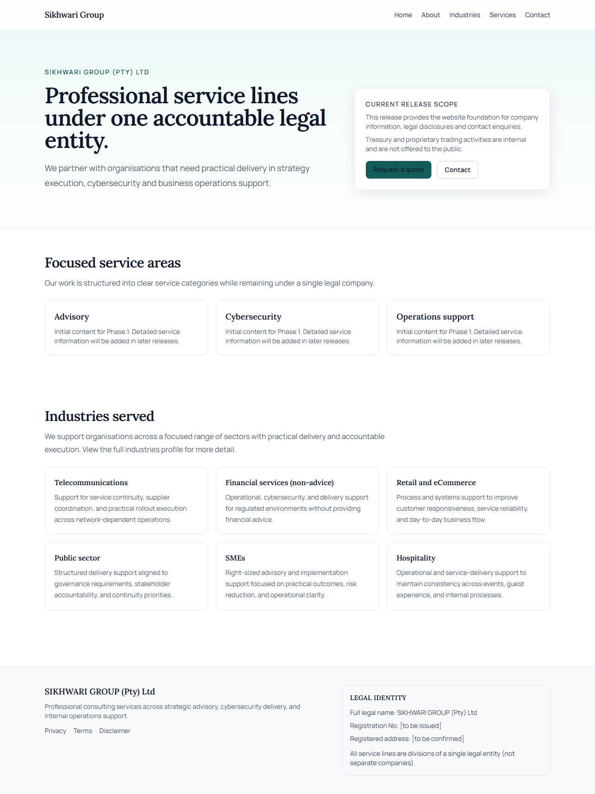
  <figcaption>Home page (Desktop, 1280x720).</figcaption>
</figure>

<figure>
  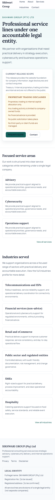
  <figcaption>Home page (Mobile, 390x844).</figcaption>
</figure>

### About

<figure>
  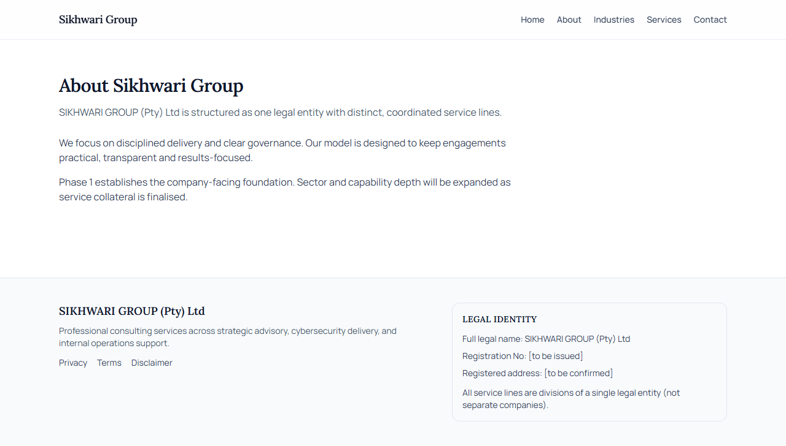
  <figcaption>About page (Desktop, 1280x720).</figcaption>
</figure>

<figure>
  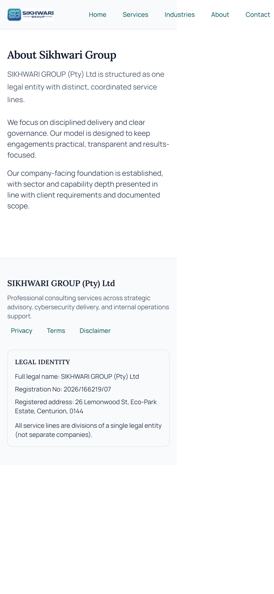
  <figcaption>About page (Mobile, 390x844).</figcaption>
</figure>

### Services

<figure>
  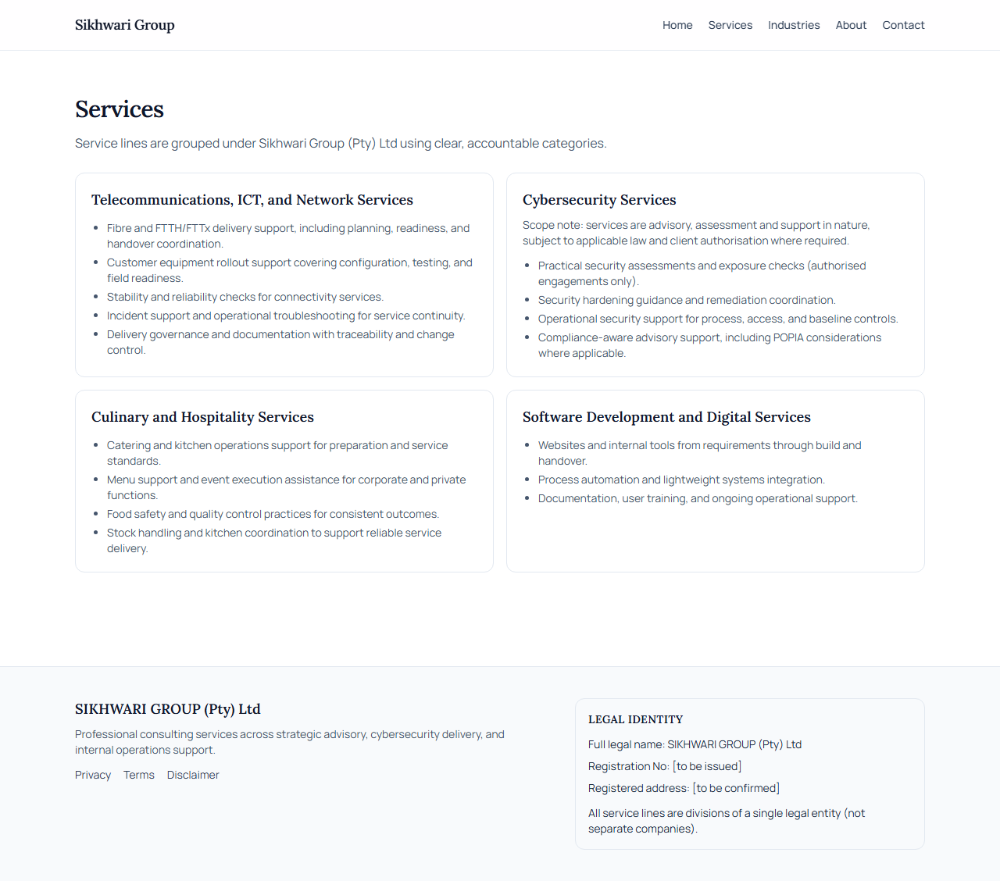
  <figcaption>Services page (Desktop, 1280x720).</figcaption>
</figure>

<figure>
  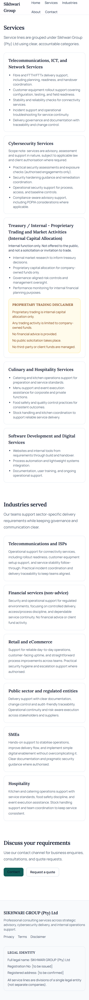
  <figcaption>Services page (Mobile, 390x844).</figcaption>
</figure>

### Contact

<figure>
  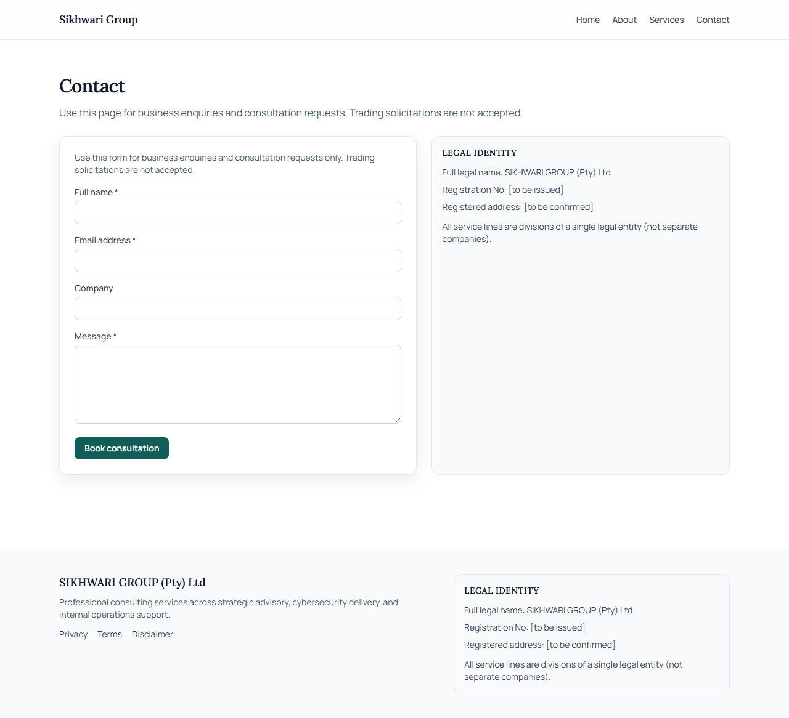
  <figcaption>Contact page (Desktop, 1280x720).</figcaption>
</figure>

<figure>
  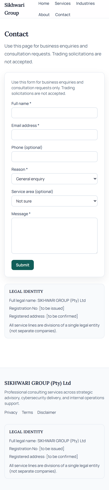
  <figcaption>Contact page (Mobile, 390x844).</figcaption>
</figure>

### Legal

<figure>
  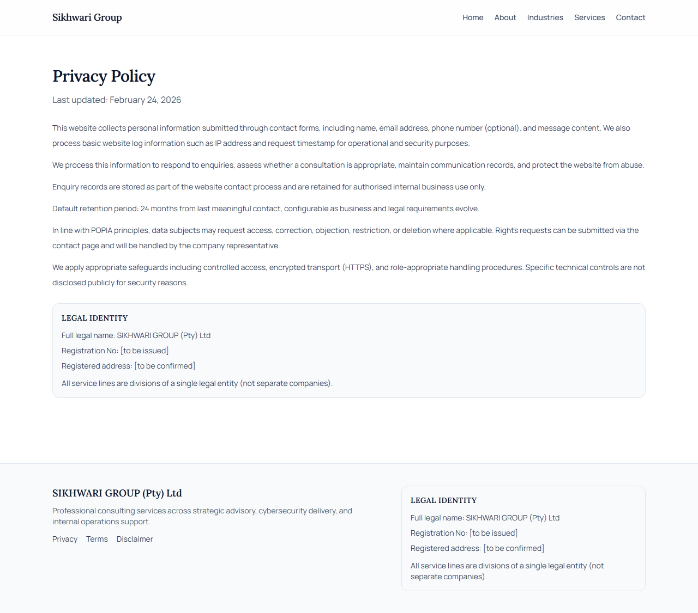
  <figcaption>Legal - Privacy page (Desktop, 1280x720).</figcaption>
</figure>

<figure>
  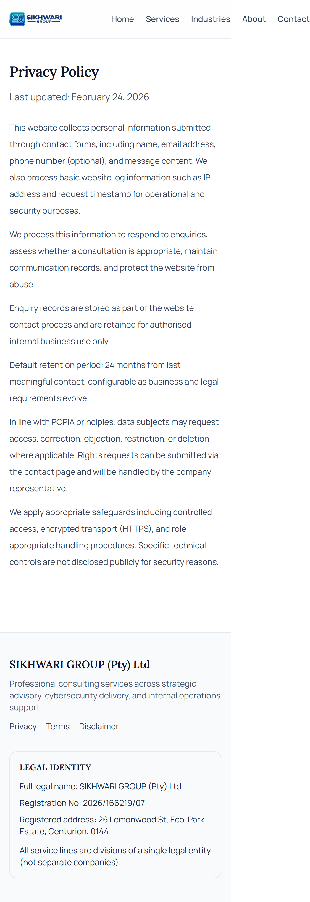
  <figcaption>Legal - Privacy page (Mobile, 390x844).</figcaption>
</figure>

<figure>
  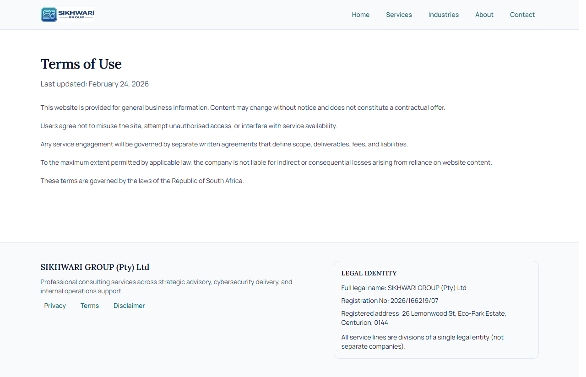
  <figcaption>Legal - Terms page (Desktop, 1280x720).</figcaption>
</figure>

<figure>
  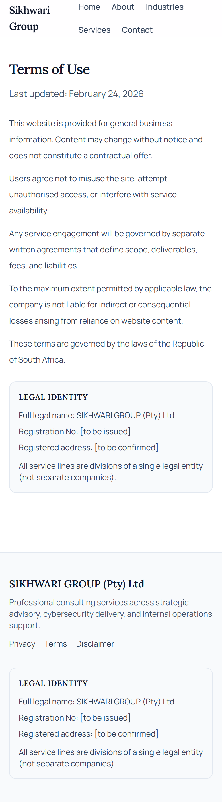
  <figcaption>Legal - Terms page (Mobile, 390x844).</figcaption>
</figure>

<figure>
  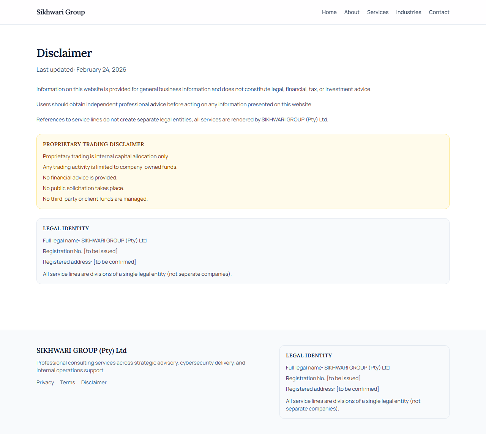
  <figcaption>Legal - Disclaimer page (Desktop, 1280x720).</figcaption>
</figure>

<figure>
  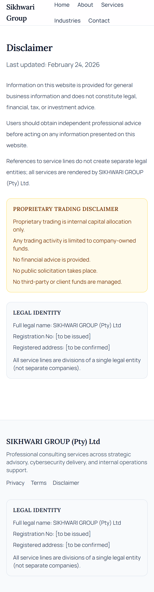
  <figcaption>Legal - Disclaimer page (Mobile, 390x844).</figcaption>
</figure>

## Deployment notes

- Placeholder: document production deployment targets, environment variables, and release checklist here.
